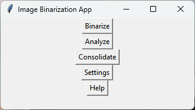

## SpheroidInvasionAnalysis
Corresponding manuscript: "Towards an Objective and High-throughput Quantification Method for Spheroid Invasion Assays" Rozanne W. Mungai, Roger J. Hartman, Grace Jolin, Kevin Piskorowski, and Kristen L. Billiar.

* DOI (will be added after publication, currently in peer-review)
* Please cite the above manuscript if you use these scripts in your research.

This repository contains **Python** scripts used to batch process images of multicellular spheroids and quantify invasion between two snapshot images. It is intended for cases where the same spheroid is imaged at an initial timepoint (such as Day 0, when no invasion has occurred) and again imaged at subsequent timepoints (such as Day 2, 4, etc...) to calculate the extent of invasion from the spheroid over time. Please see the corresponding manuscript for a use-case example.

A MATLAB version of these scripts are provided by @rmungai.


## Overview

This application consists of three main files: `quantify_image_set.py`, `binarize.py`, and `gui.py`. Each file has specific roles in the image analysis workflow, from binarizing images to analyzing and generating plots.

### quantify_image_set.py

This file contains the main logic for analyzing spheroid images. It defines several classes and functions:

- **SpheroidImage**: Represents a binarized spheroid image and provides methods to analyze the image, such as finding boundaries, performing PCA, and calculating distances.
- **QuantSpheroidSet**: Processes a set of images, sorts them by time, and loads them for analysis.
- **Various Functions**: Support functions for plotting and calculating metrics.

### binarize.py

This file handles the binarization of images, providing a class to load a grayscale image, apply a threshold to binarize it, and find contours.

- **BinarizedImage**: Handles the loading, binarization, and processing of grayscale images. It includes methods for updating masks, finding contours, calculating centroids, and saving the binarized images.

### gui.py

This file defines the graphical user interface (GUI) for the application, built using Tkinter. The GUI allows users to:

- **MainMenu**: The main menu that provides access to three functionalities: binarize images, analyze images, and consolidate CSV files.
- **ImageBinarizationApp**: Handles the binarization of images, including loading images, applying thresholds, drawing boundaries, and saving the results.
- **SpheroidAnalysisApp**: Manages the analysis of spheroid images, allowing users to select folders, input metadata, and run the analysis to calculate the metrics used in the paper.
- **CSVConcatenatorApp**: Allows users to select and concatenate multiple CSV files into a single file.

## Detailed ReadMe and Usage Guide

### Installation

#### Cloning the Repository

First, clone the repository from GitHub. Open a terminal (Command Prompt, PowerShell, or any other terminal application) and run the following command:

```bash
git clone https://github.com/rogerh2/SpheroidInvasionAnalysis.git
```

Navigate into the cloned repository:

```bash
cd SpheroidInvasionAnalysis
```

#### Installing Dependencies

When running on Windows, the application comes with everything needed to run it with embedded Python. When installing on Linux or macOS, ensure you have the necessary dependencies installed. You can do this using pip:

```bash
pip install -r requirements.txt
```

### GUI Usage Guide

#### Image Naming Conventions

The application uses the image filenames to determine which images correspond to distinct spheroids and time points. Image names should start with an integer number, denoting a unique spheroid, followed by and underscore then the time unit and another integer number representing the time the image was taken. The initial time should be 0. The time unit can be set in settings. For example see below

A valid image name:
```
1_day2_10x_CH1_8bit_18S.tif
```

An invalid image name:
```
10x_CH1_1_day2_8bit_18S.tif
```

#### Main Menu

When you run the application, the main window opens, providing access to three main functions:

- **Binarize**: Opens the Image Binarization App.
- **Analyze**: Opens the Spheroid Analysis App.
- **Consolidate**: Opens the CSV Concatenator App.



*The GUI main menu*

#### Settings Page
1. **Performance Settings** The only setting that affects performance is the batch size. The batch size is the number of pixels to process during each iteration during the analysis step. A larger batch size can lead to shorter processing times by higher RAM usage.
2. **Dimensional Settings** These set the time unit and the micrometers per pixel. The time unit should match the one used in your file name. In the example provided an image was taken each hour.
3. **Plot Settings** The GUI will automatically produce plots during the analysis step. This lets the user set the font, font size, and tick size for the axes. The plot settings can be previewed once chosen.


*The settings menu*


#### Binarize Images

1. **Open the Binarize Window**: Click on "Binarize" from the main menu.
2. **Select Folders**:
    - Click "Select Load Folder" to choose the folder containing the images you want to binarize.
    - Click "Select Save Folder" to choose the folder where the binarized images will be saved.
    - Once you have selected your folders press continue
   


*The binarize folder selection menu*

3. **Binarize Window**:
   - The main binarization menu is used to customize image binarization. It allows the user to apply binarization thresholds globally throughout an entire image or locally within a drawn mask. It also allows users to automatically remove pixels outside of the main spheroid with automatic boundary detection.
   - The images will be displayed side-by-side: the original grayscale image on the left and the binarized image on the right.
   - Use the "Threshold" slider to adjust the binarization threshold.
   - Draw boundaries on the binarized image to apply local thresholds or delete regions.
     - When a drawn boundary is on the image the threshold slider only applies to pixels inside the boundary
   - Click "Auto-Detect Boundary" to automatically detect and draw contours.
   - Click "Auto Clean" to automatically remove pixels outside the largest contour. This is to establish the initial boundary on time 0 images to calculate invasion relative to.  
   - Use the "Blur" slider to apply Gaussian blurring for better contour detection.
   - Use the "Save" button when done to save all binarized images.They will be saved in two folders within your main save folder. The folders 'masked' and 'unmasked' will have the images save both with and without circular masks applied respectively. The circular mask is for radial symmetry in spheroids where invasion outside the image can cause false non-linearity in the data.


*The binarization screen with the auto detected boundary drawn. Pressing clean will remove the artifacts highlighted in red*


#### Analyze Images

1. **Open the Analyze Window**: Click on "Analyze" from the main menu.
2. **Select Folder**: Click "Browse" to choose the folder containing the binarized images to be analyzed, choose either the masked or unmasked folder created in the prior step.
3. **Enter Metadata**: Provide optional metadata for the analysis, such as experiment number or condition.
4. **Run Analysis**: Click "Run Analysis" to start processing the images. Progress will be shown in a new window. The analysis will produce
   - The location of each pixel outside the initial boundary in radial coordinates.
   - The x-y axes correspond to the directions of maximum and minimum invasion.
   - Raw data, plots, and mean statistics used in the corresponding paper stored in a csv called "overall_summary.csv"
   - All metrics are calculated w.r.t the initial boundary


*The analyze window at 50% progress. The bar updates after each image is processed, this may take a while for larger images*


#### Consolidate CSV Files

Once all images are analyzed they can be concatenated into one csv in the GUI for easy comparison or further analysis.

1. **Open the Consolidate Window**: Click on "Consolidate" from the main menu.
2. **Select CSV Files**: Click "Select CSV Files" and select the overall_summary files from the prior step. Any summaries created in that session will autopopulate.
3. **Remove Files**: Use the "Remove Files" button to remove any selected files from the list.
4. **Concatenate Files**: Click "Concatenate Files" to merge the selected CSV files into one. You will be prompted to choose a location to save the concatenated file.


*The concatenate files window. Se*

### Running the Application

To run the application, execute the `gui.py` file:

```bash
python gui.py
```

Or double click `run.bat` file on Windows

## Usage Guide for Direct Code Usage

If you prefer to use the code directly without the GUI, follow these instructions for binarizing images, analyzing spheroid data, and consolidating CSV files.

### Setup

Ensure you have the necessary dependencies installed. You can do this using pip:

```bash
pip install -r requirements.txt
```

### Binarize Images

To binarize images directly using the `BinarizedImage` class in `binarize.py`:

1. **Import the Class**:

    ```python
    from binarize import BinarizedImage
    ```

2. **Load and Binarize an Image**:

    ```python
    # Example path to an image file
    image_path = 'path/to/image.tif'
    save_path = 'path/to/save_directory'

    # Initialize the BinarizedImage object
    bin_image = BinarizedImage(image_path, save_path, threshold=36)

    # Apply a different threshold if needed
    new_threshold = 50
    bin_image.update_mask(new_threshold)

    # Optionally, apply Gaussian blur and find contours
    bin_image.auto_contour(guassian_kernel=(5, 5))

    # Save the binarized image
    bin_image.save_binarized_image()
    ```

3. **Working with Contours and Centroids**:

    ```python
    # Find the centroid of the spheroid
    centroid = bin_image.find_spheroid_centroid()

    # Create and apply a circular mask centered at the centroid
    bin_image.create_circular_mask()
    ```

### Analyze Spheroid Images

To analyze a set of spheroid images using the `QuantSpheroidSet` class in `quantify_image_set.py`:

1. **Import the Necessary Classes and Functions**:

    ```python
    from quantify_image_set import QuantSpheroidSet, analysis_logic
    from queue import Queue
    ```

2. **Set Up Analysis Parameters**:

    ```python
    data_fldr = 'path/to/spheroid_images'
    save_path = 'path/to/save_directory'
    pattern = r'day(\d+)'  # Example pattern to extract time points from filenames
    time_unit = 'day'
    pixel_scale = 1.0  # Microns per pixel
    font_spec = {'fontname': 'Arial', 'size': 12}
    tick_size = 11

    # Initialize the kill queue
    kill_queue = Queue()

    # Metadata dictionary
    master_id_dict = {'experiment #': 19, 'condition': 'dynamic'}

    # Run the analysis
    summary_path = analysis_logic(data_fldr, master_id_dict, print, kill_queue, pattern, time_unit, pixel_scale, font_spec, tick_size, save_images_to_pdf=False)

    print(f'Analysis complete. Summary saved at: {summary_path}')
    ```
